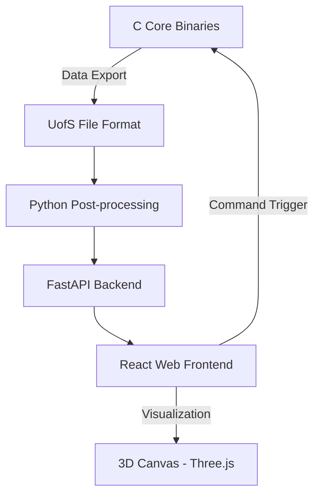

# SAP and 2SAP Research Toolkit


A high-performance research toolkit for the study of **Self-Avoiding Polygons (SAPs)** and **Two-Polygon Systems (2SAPs)** in finite $L \times M$ lattice tubes. This project supports the topological and statistical analysis of SAPs through transfer-matrix methods, Monte Carlo sampling, and interactive visualization.

Developed as part of my [Ph.D. dissertation](https://harvest.usask.ca/items/021d9d39-cc85-4584-a7ca-2d594f462496).

---

## 📑 Table of Contents
- [Features](#-features)
- [Project Architecture](#-project-architecture)
- [Getting Started](#-getting-started)
  - [Prerequisites](#1-prerequisites)
  - [Installation](#2-installation)
  - [Web Workbench Setup](#3-web-workbench-setup)
- [Core Workflows (CLI)](#-core-workflows-cli)
- [Interactive Workbench](#-interactive-workbench)
- [Project Structure](#-project-structure)
- [Academic Context & Citation](#-academic-context--citation)
- [License](#-license)

---

## ✨ Features
- **Transfer-Matrix Engine**: High-performance C implementation for spectral calculations and connective constant estimation.
- **Monte Carlo Sampler**: Transition-indexed right eigenvector guided sampling for SAPs and 2SAPs.
- **Exhaustive Enumeration**: Tools for generating every possible configuration in small lattices.
- **Web Workbench**: A modern React/Vite/FastAPI interface for simulation management and 3D visualization.
- **Topological Analysis**: Automated calculation of linking numbers, edge distributions, and contact statistics.

---

## 🏗 Project Architecture



---

## 🚀 Getting Started

### 1. Prerequisites
Ensure you have the following installed (Ubuntu/WSL2 recommended):
- **C Development**: `gcc`, `make`, and **OpenMP**.
  - *Note for macOS users*: Standard `clang` does not include OpenMP; use `brew install llvm` and configure your compiler flags.
- **Python**: Python 3.10+ with `venv`.
- **Web Development**: Node.js 18+ and `npm`.

### 2. Installation
Clone the repository and build the core C binaries:
```bash
git clone https://github.com/jwe811/eng_phd_code.git
cd eng_phd_code
make -j$(nproc)
```

### 3. Web Workbench Setup
The workbench uses a Python backend and a React frontend.

**Backend Setup:**
```bash
cd web/backend
python3 -m venv .venv
source .venv/bin/activate
pip install -r requirements.txt
cd ../..
```

**Frontend Setup:**
```bash
cd web/frontend
npm install
cd ../..
```

### 4. Launching the Workbench
Launch both services with a single command:
```bash
make web-dev
```
- **Frontend**: [http://127.0.0.1:5173](http://127.0.0.1:5173)
- **Backend API**: [http://127.0.0.1:8000](http://127.0.0.1:8000)

---

## 🛠 Core Workflows (CLI)

### Exhaustive Generation
Generate every possible polygon of an exact span in a specific tube.
```bash
# All standard SAPs of span 2 in a 1x1 tube
bin/creator_all -L 1 -M 1 -m 0 -s 2
```

### Monte Carlo Sampling
Generate random samples using transition-indexed right eigenvectors.
```bash
# Generate 50 random samples at span 5 in a 2x1 tube
bin/mc_master -L 2 -M 1 -m 0 -s 5 -n 50 -r 1 -S 12345
```

### Transfer-Matrix Calculations
Calculate connective constants and export eigenvectors.
```bash
# Standard SAP connective constant for a 2x1 tube
bin/tm_master -L 2 -M 1 -m 0
```

---

## 🌐 Interactive Workbench
The SAP Workbench provides a graphical interface for:
- **Run Launcher**: Visual configuration of simulation parameters.
- **Job History**: Monitoring background processes and logs.
- **Data Browser**: Navigating the `data/` directory with raw text and 3D preview.
- **3D Visualize**: Interactive WebGL rendering of polygon structures.
- **Analysis**: Real-time plotting of edge counts, spans, and topological data.

---

## 📂 Project Structure
```text
.
├── bin/            # Compiled C binaries
├── data/           # Simulation outputs and results
├── docs/           # Detailed documentation (File formats, etc.)
├── include/        # C header files
├── src/            # Core C implementation
├── scripts/        # Python tools for analysis and automation
├── web/            # Full-stack workbench (FastAPI + React)
└── Makefile        # Build system
```

---

## 📖 Reference & Academic Context

### Simulation Modes
| Mode | Name | Meaning |
| :--- | :--- | :------ |
| `0` | Standard SAP | Single self-avoiding polygon |
| `1` | Hamiltonian SAP | Polygon visiting every vertex in each section |
| `2` | 2SAP | Two polygons sharing the same lattice |
| `3` | 2SAP-Hamiltonian | Two polygons whose union is Hamiltonian |

### Coordinate Convention
The toolkit uses a consistent coordinate system:
- **X-axis**: Tube direction (span).
- **Y-axis**: Tube width ($L$).
- **Z-axis**: Tube height ($M$).

For details on the `UofS` output format, see [docs/uofs_format.md](docs/uofs_format.md).

### 🎓 Citation
If you use this toolkit in your research, please cite the following dissertation:

> **Eng, Jeremy.** (2020). *Topological and Statistical Properties of Self-Avoiding Polygons in Lattice Tubes*. Ph.D. Dissertation, University of Saskatchewan. [Available at Harvest](https://harvest.usask.ca/items/021d9d39-cc85-4584-a7ca-2d594f462496).

---

## ⚖ License
This project is licensed under the MIT License - see the [LICENSE](LICENSE) file for details.

---
*Created by Dr. Jeremy Eng*